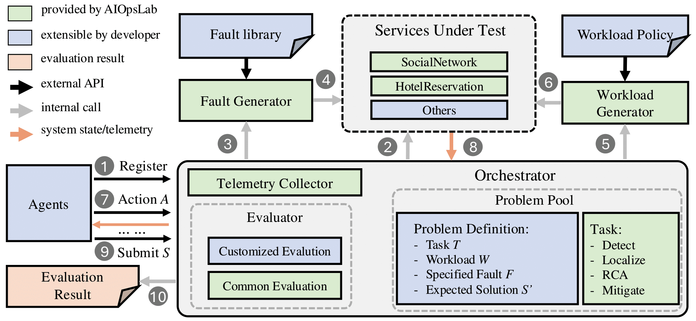

<div align="center">

<h1>AIOpsLab</h1>

[🤖Overview](#🤖overview) | 
[🚀Quick Start](#🚀quickstart) | 
[📦Installation](#📦installation) | 
[⚙️Usage](#⚙️usage) | 
[📂Project Structure](#📂project-structure) |
[📄How to Cite](#📄how-to-cite)

[](https://arxiv.org/pdf/2501.06706)
[](https://arxiv.org/pdf/2407.12165)
</div>


<h2 id="🤖overview">🤖 Overview</h2>




AIOpsLab is a holistic framework to enable the design, development, and evaluation of autonomous AIOps agents that, additionally, serve the purpose of building reproducible, standardized, interoperable and scalable benchmarks. AIOpsLab can deploy microservice cloud environments, inject faults, generate workloads, and export telemetry data, while orchestrating these components and providing interfaces for interacting with and evaluating agents. 

Moreover, AIOpsLab provides a built-in benchmark suite with a set of problems to evaluate AIOps agents in an interactive environment. This suite can be easily extended to meet user-specific needs. See the problem list [here](/aiopslab/orchestrator/problems/registry.py#L15).

<h2 id="📦installation">📦 Installation</h2>

### Requirements
- Python >= 3.11
- [Helm](https://helm.sh/)

Recommended installation:
```bash
sudo apt install python3.11 python3.11-venv python3.11-dev python3-pip # poetry requires python >= 3.11
```

We recommend [Poetry](https://python-poetry.org/docs/) for managing dependencies. You can also use a standard `pip install -e .` to install the dependencies.

```bash
git clone --recurse-submodules <CLONE_PATH_TO_THE_REPO>
cd AIOpsLab
poetry env use python3.11
export PATH="$HOME/.local/bin:$PATH" # export poetry to PATH if needed
poetry install # -vvv for verbose output
poetry self add poetry-plugin-shell # installs poetry shell plugin
poetry shell
```

<h2 id="🚀quickstart">🚀 Quick Start </h2>

<!-- TODO: Add instructions for both local cluster and remote cluster -->
Choose either a) or b) to set up your cluster and then proceed to the next steps.

### a) Local simulated cluster
AIOpsLab can be run on a local simulated cluster using [kind](https://kind.sigs.k8s.io/) on your local machine.

```bash
# For x86 machines
kind create cluster --config kind/kind-config-x86.yaml

# For ARM machines
kind create cluster --config kind/kind-config-arm.yaml
```

If you're running into issues, consider building a Docker image for your machine by following this [README](kind/README.md). Please also open an issue.

### [Tips]
If you are running AIOpsLab using a proxy, beware of exporting the HTTP proxy as `172.17.0.1`. When creating the kind cluster, all the nodes in the cluster will inherit the proxy setting from the host environment and the Docker container. 

The `172.17.0.1` address is used to communicate with the host machine. For more details, refer to the official guide: [Configure Kind to Use a Proxy](https://kind.sigs.k8s.io/docs/user/quick-start/#configure-kind-to-use-a-proxy).

Additionally, Docker doesn't support SOCKS5 proxy directly. If you're using a SOCKS5 protocol to proxy, you may need to use [Privoxy](https://www.privoxy.org) to forward SOCKS5 to HTTP.

If you're running VLLM and the LLM agent locally, Privoxy will by default proxy `localhost`, which will cause errors. To avoid this issue, you should set the following environment variable:

```bash
export no_proxy=localhost
``` 

After finishing cluster creation, proceed to the next "Update `config.yml`" step.

### b) Remote cluster
AIOpsLab supports any remote kubernetes cluster that your `kubectl` context is set to, whether it's a cluster from a cloud provider or one you build yourself. We have some Ansible playbooks to setup clusters on providers like [CloudLab](https://www.cloudlab.us/) and our own machines. Follow this [README](./scripts/ansible/README.md) to set up your own cluster, and then proceed to the next "Update `config.yml`" step.

### Update `config.yml`
```bash
cd aiopslab
cp config.yml.example config.yml
```
Update your `config.yml` so that `k8s_host` is the host name of the control plane node of your cluster. Update `k8s_user` to be your username on the control plane node. If you are using a kind cluster, your `k8s_host` should be `kind`. If you're running AIOpsLab on cluster, your `k8s_host` should be `localhost`.

### Running agents
Human as the agent:

```bash
python3 cli.py
(aiopslab) $ start misconfig_app_hotel_res-detection-1 # or choose any problem you want to solve
# ... wait for the setup ...
(aiopslab) $ submit("Yes") # submit solution
```

Run GPT-4 baseline agent:

```bash
export OPENAI_API_KEY=<YOUR_OPENAI_API_KEY>
python3 clients/gpt.py # you can also change the problem to solve in the main() function
```

You can check the running status of the cluster using [k9s](https://k9scli.io/) or other cluster monitoring tools conveniently.

<h2 id="⚙️usage">⚙️ Usage</h2>

AIOpsLab can be used in the following ways:
- [Onboard your agent to AIOpsLab](#how-to-onboard-your-agent-to-aiopslab)
- [Add new applications to AIOpsLab](#how-to-add-new-applications-to-aiopslab)
- [Add new problems to AIOpsLab](#how-to-add-new-problems-to-aiopslab)


### How to onboard your agent to AIOpsLab?

AIOpsLab makes it extremely easy to develop and evaluate your agents. You can onboard your agent to AIOpsLab in 3 simple steps:

1. **Create your agent**: You are free to develop agents using any framework of your choice. The only requirements are:
    - Wrap your agent in a Python class, say `Agent`
    - Add an async method `get_action` to the class:

        ```python
        # given current state and returns the agent's action
        async def get_action(self, state: str) -> str:
            # <your agent's logic here>
        ```

2. **Register your agent with AIOpsLab**: You can now register the agent with AIOpsLab's orchestrator. The orchestrator will manage the interaction between your agent and the environment:

    ```python
    from aiopslab.orchestrator import Orchestrator

    agent = Agent()             # create an instance of your agent
    orch = Orchestrator()       # get AIOpsLab's orchestrator
    orch.register_agent(agent)  # register your agent with AIOpsLab
    ```

3. **Evaluate your agent on a problem**:

    1. **Initialize a problem**: AIOpsLab provides a list of problems that you can evaluate your agent on. Find the list of available problems [here](/aiopslab/orchestrator/problems/registry.py) or using `orch.probs.get_problem_ids()`. Now initialize a problem by its ID: 

        ```python
        problem_desc, instructs, apis = orch.init_problem("k8s_target_port-misconfig-mitigation-1")
        ```
    
    2. **Set agent context**: Use the problem description, instructions, and APIs available to set context for your agent. (*This step depends on your agent's design and is left to the user*)


    3. **Start the problem**: Start the problem by calling the `start_problem` method. You can specify the maximum number of steps too:

        ```python
        import asyncio
        asyncio.run(orch.start_problem(max_steps=30))
        ```

This process will create a [`Session`](/aiopslab/session.py) with the orchestrator, where the agent will solve the problem. The orchestrator will evaluate your agent's solution and provide results (stored under `data/results/`). You can use these to improve your agent.


### How to add new applications to AIOpsLab?

AIOpsLab provides a default [list of applications](/aiopslab/service/apps/) to evaluate agents for operations tasks. However, as a developer you can add new applications to AIOpsLab and design problems around them.

> *Note*: for auto-deployment of some apps with K8S, we integrate Helm charts (you can also use `kubectl` to install as [HotelRes application](/aiopslab/service/apps/hotelres.py)). More on Helm [here](https://helm.sh).

To add a new application to AIOpsLab with Helm, you need to:

1. **Add application metadata**
    - Application metadata is a JSON object that describes the application.
    - Include *any* field such as the app's name, desc, namespace, etc.
    - We recommend also including a special `Helm Config` field, as follows:

        ```json
        "Helm Config": {
            "release_name": "<name for the Helm release to deploy>",
            "chart_path": "<path to the Helm chart of the app>",
            "namespace": "<K8S namespace where app should be deployed>"
        }
        ```
        > *Note*: The `Helm Config` is used by the orchestrator to auto-deploy your app when a problem associated with it is started.

        > *Note*: The orchestrator will auto-provide *all other* fields as context to the agent for any problem associated with this app.

    Create a JSON file with this metadata and save it in the [`metadata`](/aiopslab/service/metadata) directory. For example the `social-network` app: [social-network.json](/aiopslab/service/metadata/social-network.json)

2. **Add application class**

    Extend the base class in a new Python file in the [`apps`](/aiopslab/service/apps) directory:

    ```python
    from aiopslab.service.apps.base import Application

    class MyApp(Application):
        def __init__(self):
            super().__init__("<path to app metadata JSON>")
    ```

    The `Application` class provides a base implementation for the application. You can override methods as needed and add new ones to suit your application's requirements, but the base class should suffice for most applications.


### How to add new problems to AIOpsLab?

Similar to applications, AIOpsLab provides a default [list of problems](/aiopslab/orchestrator/problems/registry.py) to evaluate agents. However, as a developer you can add new problems to AIOpsLab and design them around your applications.

Each problem in AIOpsLab has 5 components:
1. *Application*: The application on which the problem is based.
2. *Task*: The AIOps task that the agent needs to perform.
 Currently we support: [Detection](/aiopslab/orchestrator/tasks/detection.py), [Localization](/aiopslab/orchestrator/tasks/localization.py), [Analysis](/aiopslab/orchestrator/tasks/analysis.py), and [Mitigation](/aiopslab/orchestrator/tasks/mitigation.py).
3. *Fault*: The fault being introduced in the application.
4. *Workload*: The workload that is generated for the application.
5. *Evaluator*: The evaluator that checks the agent's performance.

To add a new problem to AIOpsLab, create a new Python file 
in the [`problems`](/aiopslab/orchestrator/problems) directory, as follows:

1. **Setup**. Import your chosen application (say `MyApp`) and task (say `LocalizationTask`):

    ```python
    from aiopslab.service.apps.myapp import MyApp
    from aiopslab.orchestrator.tasks.localization import LocalizationTask
    ```

2. **Define**. To define a problem, create a class that inherits from your chosen `Task`, and defines 3 methods: `start_workload`, `inject_fault`, and `eval`:

    ```python
    class MyProblem(LocalizationTask):
        def __init__(self):
            self.app = MyApp()
        
        def start_workload(self):
            # <your workload logic here>
        
        def inject_fault(self)
            # <your fault injection logic here>
        
        def eval(self, soln, trace, duration):
            # <your evaluation logic here>
    ```

3. **Register**. Finally, add your problem to the orchestrator's registry [here](/aiopslab/orchestrator/problems/registry.py).


See a full example of a problem [here](/aiopslab/orchestrator/problems/k8s_target_port_misconfig/target_port.py). 
<details>
  <summary>Click to show the description of the problem in detail</summary>

- **`start_workload`**: Initiates the application's workload. Use your own generator or AIOpsLab's default, which is based on [wrk2](https://github.com/giltene/wrk2):

    ```python
    from aiopslab.generator.workload.wrk import Wrk

    wrk = Wrk(rate=100, duration=10)
    wrk.start_workload(payload="<wrk payload script>", url="<app URL>")
    ```
    > Relevant Code: [aiopslab/generators/workload/wrk.py](/aiopslab/generators/workload/wrk.py)

- **`inject_fault`**: Introduces a fault into the application. Use your own injector or AIOpsLab's built-in one which you can also extend. E.g., a misconfig in the K8S layer:

    ```python
    from aiopslab.generators.fault.inject_virtual import *

    inj = VirtualizationFaultInjector(testbed="<namespace>")
    inj.inject_fault(microservices=["<service-name>"], fault_type="misconfig")
    ```

    > Relevant Code: [aiopslab/generators/fault](/aiopslab/generators/fault)


- **`eval`**: Evaluates the agent's solution using 3 params: (1) *soln*: agent's submitted solution if any, (2) *trace*: agent's action trace, and (3) *duration*: time taken by the agent.

    Here, you can use built-in default evaluators for each task and/or add custom evaluations. The results are stored in `self.results`:
    ```python
    def eval(self, soln, trace, duration) -> dict:
        super().eval(soln, trace, duration)     # default evaluation
        self.add_result("myMetric", my_metric(...))     # add custom metric
        return self.results
    ```

    > *Note*: When an agent starts a problem, the orchestrator creates a [`Session`](/aiopslab/session.py) object that stores the agent's interaction. The `trace` parameter is this session's recorded trace.

    > Relevant Code: [aiopslab/orchestrator/evaluators/](/aiopslab/orchestrator/evaluators/)

</details>


<h2 id="📂project-structure">📂 Project Structure</h2>

<summary><code>aiopslab</code></summary>
<details>
  <summary>Generators</summary>
  <pre>
  generators - the problem generators for aiopslab
  ├── fault - the fault generator organized by fault injection level
  │   ├── base.py
  │   ├── inject_app.py
  │  ...
  │   └── inject_virtual.py
  └── workload - the workload generator organized by workload type
      └── wrk.py - wrk tool interface
  </pre>
</details>

<details>
  <summary>Orchestrator</summary>
  <pre>
  orchestrator
  ├── orchestrator.py - the main orchestration engine
  ├── parser.py - parser for agent responses
  ├── evaluators - eval metrics in the system
  │   ├── prompts.py - prompts for LLM-as-a-Judge
  │   ├── qualitative.py - qualitative metrics
  │   └── quantitative.py - quantitative metrics
  ├── problems - problem definitions in aiopslab
  │   ├── k8s_target_port_misconfig - e.g., A K8S TargetPort misconfig problem
  │  ...
  │   └── registry.py
  ├── actions - actions that agents can perform organized by AIOps task type
  │   ├── base.py
  │   ├── detection.py
  │   ├── localization.py
  │   ├── analysis.py
  │   └── mitigation.py
  └── tasks - individual AIOps task definition that agents need to solve
      ├── base.py
      ├── detection.py
      ├── localization.py
      ├── analysis.py
      └── mitigation.py
  </pre>
</details>

<details>
  <summary>Service</summary>
  <pre>
  service
  ├── apps - interfaces/impl. of each app
  ├── helm.py - helm interface to interact with the cluster
  ├── kubectl.py - kubectl interface to interact with the cluster
  ├── shell.py - shell interface to interact with the cluster
  ├── metadata - metadata and configs for each apps
  └── telemetry - observability tools besides observer, e.g., in-memory log telemetry for the agent
  </pre>
</details>

<details>
  <summary>Observer</summary>
  <pre>
  observer
  ├── filebeat - Filebeat installation
  ├── logstash - Logstash installation
  ├── prometheus - Prometheus installation
  ├── log_api.py - API to store the log data on disk
  ├── metric_api.py - API to store the metrics data on disk
  └── trace_api.py - API to store the traces data on disk
  </pre>
</details>

<details>
  <summary>Utils</summary>
  <pre>
  ├── config.yml - aiopslab configs
  ├── config.py - config parser
  ├── paths.py - paths and constants
  ├── session.py - aiopslab session manager
  └── utils
      ├── actions.py - helpers for actions that agents can perform
      ├── cache.py - cache manager
      └── status.py - aiopslab status, error, and warnings
  </pre>
</details>

<summary><code>cli.py</code>: A command line interface to interact with AIOpsLab, e.g., used by human operators.</summary>


<h2 id="📄how-to-cite">📄 How to Cite</h2>

```bibtex
@misc{chen2024aiopslab,
  title = {AIOpsLab: A Holistic Framework to Evaluate AI Agents for Enabling Autonomous Clouds},
  author = {Chen, Yinfang and Shetty, Manish and Somashekar, Gagan and Ma, Minghua and Simmhan, Yogesh and Mace, Jonathan and Bansal, Chetan and Wang, Rujia and Rajmohan, Saravan},
  year = {2025},
  url = {https://arxiv.org/abs/2501.06706} 
}
@inproceedings{shetty2024building,
  title = {Building AI Agents for Autonomous Clouds: Challenges and Design Principles},
  author = {Shetty, Manish and Chen, Yinfang and Somashekar, Gagan and Ma, Minghua and Simmhan, Yogesh and Zhang, Xuchao and Mace, Jonathan and Vandevoorde, Dax and Las-Casas, Pedro and Gupta, Shachee Mishra and Nath, Suman and Bansal, Chetan and Rajmohan, Saravan},
  year = {2024},
  booktitle = {Proceedings of 15th ACM Symposium on Cloud Computing},
}
```

## Code of Conduct

This project has adopted the [Microsoft Open Source Code of Conduct](https://opensource.microsoft.com/codeofconduct/). For more information see the [Code of Conduct FAQ](https://opensource.microsoft.com/codeofconduct/faq/) or contact [opencode@microsoft.com](mailto:opencode@microsoft.com) with any additional questions or comments.


## License

Copyright (c) Microsoft Corporation. All rights reserved.

Licensed under the [MIT](LICENSE.txt) license.


### Trademarks

This project may contain trademarks or logos for projects, products, or services. Authorized use of Microsoft trademarks or logos is subject to and must follow [Microsoft’s Trademark & Brand Guidelines](https://www.microsoft.com/en-us/legal/intellectualproperty/trademarks). Use of Microsoft trademarks or logos in modified versions of this project must not cause confusion or imply Microsoft sponsorship. Any use of third-party trademarks or logos is subject to those third-party’s policies.
