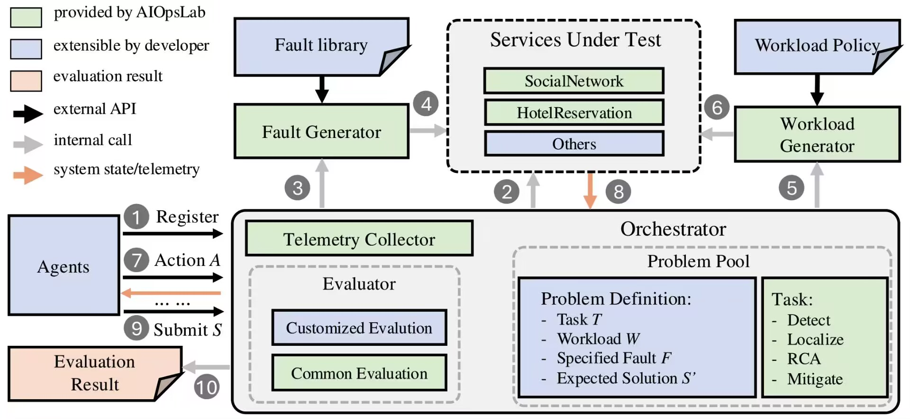

---
hide:
  - navigation
  - toc
---

    <!-- title -->
    

        
&nbspAIOPSLAB
<!-- URL of logo -->
        
A HOLISTIC FRAMEWORK TO EVALUATE AI AGENTS FOR ENABLING AUTONOMOUS CLOUDS

    

    
<a href="https://aka.ms/m365research-org" class=textM365 target="_blank">M365 Research - AIOps Team</a>

    <!-- navigation -->
    

        
        
            
                <a href="pages/leaderboard" class="link-btn">
                    <i class="fa-solid fa-table-list"></i>&nbspLeaderboard
                </a>
            
            
                <a href="https://www.microsoft.com/en-us/research/publication/aiopslab-a-holistic-framework-for-evaluating-ai-agents-for-enabling-autonomous-cloud" class="link-btn button" target="_blank">
                    <i class="fa-solid fa-file-lines"></i>&nbspPaper<!-- URL of paper -->
                </a>
            
            
                <a href=""class="link-btn" target="_blank">
                    <i class="fa-brands fa-github"></i>&nbspCode<!-- URL of code -->
                </a>
            
        

    

<!-- news -->

    <h1 style="color: #4A90E2;">News</h1>
    
🆕 [11/2024] Checkout our arxiv paper "AIOpsLab: A Holistic Framework for Evaluating AI Agents for Enabling Autonomous Cloud" 👀
        <a href="https://www.microsoft.com/en-us/research/publication/aiopslab-a-holistic-framework-for-evaluating-ai-agents-for-enabling-autonomous-cloud" target="_blank">[Link]</a> 

    
🆕  [10/2024] Our vision paper "Building AI Agents for Autonomous Clouds: Challenges and Design Principles" was accepted by SoCC'24 👀
        <a href="https://www.microsoft.com/en-us/research/publication/building-ai-agents-for-autonomous-clouds-challenges-and-design-principles" target="_blank">[Link]</a> 

<!-- about -->

    <h1 style="color: #4A90E2;">About</h1>
    
AIOpsLab is a holistic framework to enable the design, development, and evaluation of autonomous AIOps agents that, additionally, serves the purpose of building reproducible, standardized, interoperable and scalable benchmarks. AIOpsLab can deploy microservice cloud environments, inject faults, generate workloads, and export telemetry data, while orchestrating these components and providing interfaces for interacting with and evaluating agents. Moreover, AIOpsLab provides a built-in benchmark suite with a set of problems to evaluate AIOps agents in an interactive environment. This suite can be easily extended to meet user-specific needs. 

    
    
The Orchestrator coordinates interactions between various system components and serves as the <b>Agent-Cloud-Interface (ACI)</b>. Agents engage with the Orchestrator to solve tasks, receiving a problem description, instructions, and relevant APIs. The Orchestrator generates diverse problems using the Workload and Fault Generators, injecting these into applications it can deploy. The deployed service has observability, providing telemetry such as metrics, traces, and logs. Agents act via the Orchestrator, which executes them and updates the service's state. The Orchestrator evaluates the final solution using predefined metrics for the task.

<!-- BibTex -->

    <h1 style="color: #4A90E2;">BibTeX</h1>
    <pre><code>
    @inproceedings{shetty2024building,
        title = {Building AI Agents for Autonomous Clouds: Challenges and Design Principles},
        author = {Shetty, Manish and Chen, Yinfang and Somashekar, Gagan and Ma, Minghua and Simmhan, Yogesh and Zhang, Xuchao and Mace, Jonathan and Vandevoorde, Dax and Las-Casas, Pedro and Gupta, Shachee Mishra and Nath, Suman and Bansal, Chetan and Rajmohan, Saravan},
        year = {2024},
        booktitle = {Proceedings of 15th ACM Symposium on Cloud Computing (SoCC'24)},
    }
    @misc{chen2024aiopslab,
        title = {AIOpsLab: A Holistic Framework to Evaluate AI Agents for Enabling Autonomous Clouds},
        author = {Chen, Yinfang and Shetty, Manish and Somashekar, Gagan and Ma, Minghua and Simmhan, Yogesh and Mace, Jonathan and Bansal, Chetan and Wang, Rujia and Rajmohan, Saravan},
        year = {2024},
        booktitle = {Arxiv}
    } 
    </code>
    </pre>

